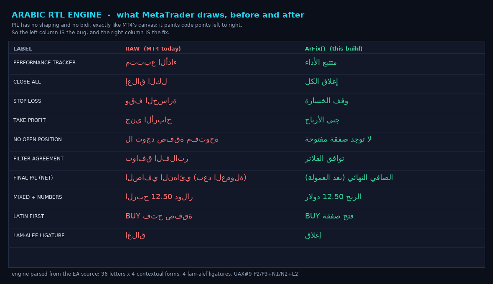
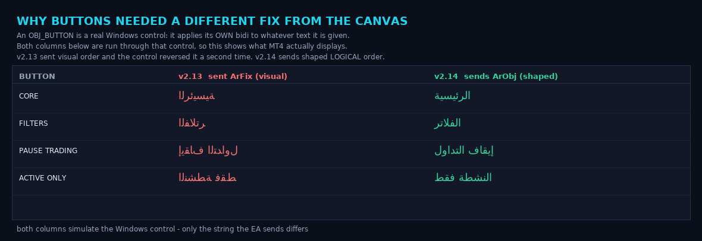
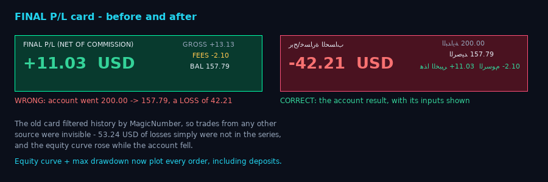
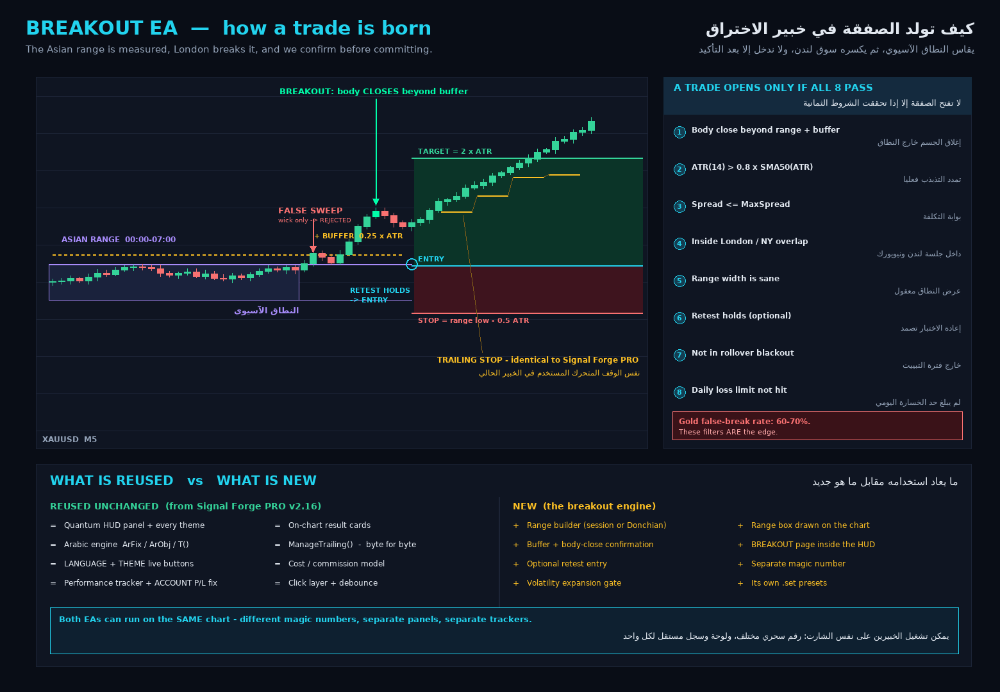
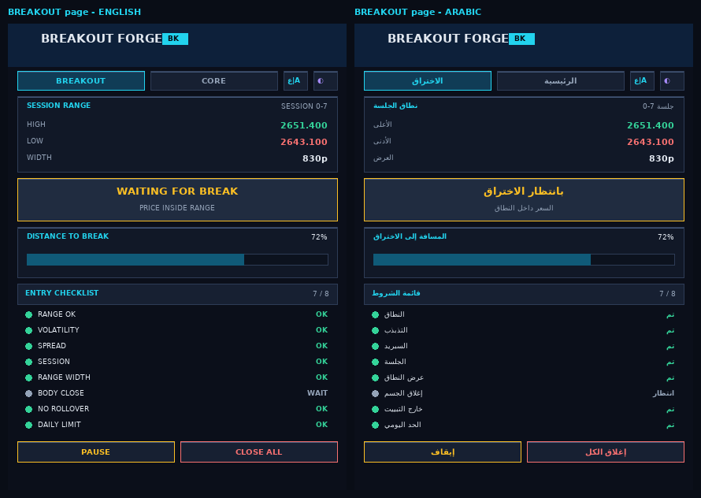
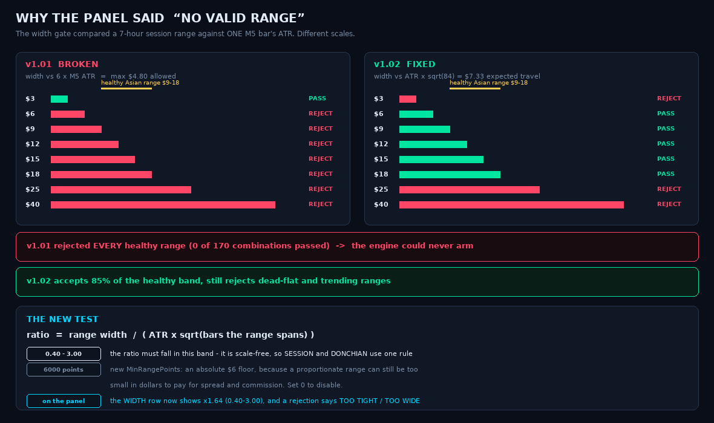
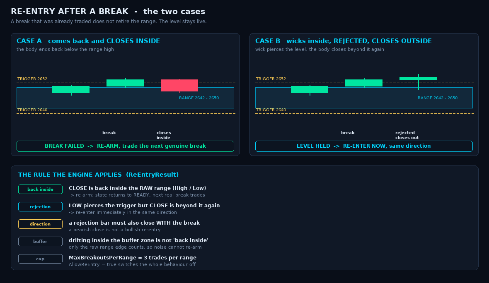

# Signal Forge PRO — XAUUSD M5 EA (v2.16)

> **v2.05 — the ORIGINAL v1 trading strategy has been restored.**
> The trading engine is now exactly the v1 engine. The entire v2 risk layer
> (sessions, daily loss cap, equity kill-switch, cooldown, adaptive spread,
> cost-aware TP floor, partials, break-even stop, chandelier trail, time stop,
> risk/ladder sizing, weighted confluence scoring) has been **deleted**.
> What is kept from v2 is the **interface only**: the Quantum HUD, the chart
> visuals and the performance tracker, re-pointed at v1 concepts.
> Sections 2–5 below describe the v2 engine and are retained for history —
> **they no longer reflect what the EA does.** See the v2.05 section at the
> bottom for the current behaviour.

A visual rebuild of *Signal Forge XAUUSD M5 EA* for a **$200 Exness Raw Spread
gold account where every 0.01 lot costs $0.07 round turn.**

| | v1 (original) | v2.05 (current) |
|---|---|---|
| **Trading logic** | 11 equal-vote filters, AND/OR | **identical — v1 restored** |
| Interface | ~20 static rectangle/label objects | Single **antialiased Canvas HUD**, 3 pages, gauge, meters, hover, hotkeys |
| Result cards | one-line price tag | **solid raised multi-row cards**, live + closed, overlap-free placement |
| Tracker | none | **DATE · LOT · PROFIT · GAIN% · WINRATE · COMMISSION · FINAL P/L** |
| Sizing | Fixed 0.01 lots | **identical — fixed lots** |
| Risk layer | none | **none (removed in v2.05)** |
| Cost model | none | **reporting only** — never gates a trade |
| Lines of code | 1,710 | 2,714 |


---

## 1. The cost model (why this EA exists)

Exness Raw Spread charges **$3.50 per lot per side** on XAUUSD — $7.00 round turn,
or **$0.07 per 0.01 lot**. On a 3-digit gold feed:

```
1 point (0.001) on 0.01 lot  =  $0.001
$0.07 commission             =  70 points of price movement
```

That **70-point tax is constant regardless of lot size**, which is the key insight:
commission can be treated as a fixed price distance and folded directly into stops,
targets and break-even. The EA computes this at runtime from `MODE_TICKVALUE`, so it
stays correct if your broker's spec differs.

Verified numbers from the shipped defaults:

| Spread | Round turn | Min TP (3×) |
|---|---|---|
| 10 pts | 80 pts ($0.08) | 240 pts ($0.24) |
| 40 pts | 110 pts ($0.11) | 330 pts ($0.33) |
| 130 pts | 200 pts ($0.20) | 600 pts ($0.60) |

Three places this is enforced:

- **`MinTPtoCostRatio`** — a target must clear 3× the full round turn, or the trade is
  mathematically negative-expectancy no matter the win rate.
- **Stop guard** — stops are floored at 1.5× round turn so cost alone can't stop you out.
- **True break-even** — `BreakEvenPrice()` shifts by spread + commission + lock, so "flat"
  means flat *after the broker is paid*, not flat on the chart.

### Commission drag on a $200 account

| Lots | Per trade | % of $200 | 30 trades/month |
|---|---|---|---|
| 0.01 | $0.07 | 0.035% | **1.05%** |
| 0.02 | $0.14 | 0.070% | **2.10%** |

This is precisely why `MaxTradesPerDay=6` and `MinBarsBetweenTrades=3` ship as defaults.
Overtrading a micro account is a slow bleed, not a dramatic blowup.

---

## 2. Position sizing for a $200 account

`SizingMode = SF_SIZE_RISK` solves for lots including commission:

```
lots × (pointValue × slPoints)  +  lots/0.01 × $0.07  =  equity × risk%
```

Validated output at 1% risk:

| Balance | SL 1500 pts | Lots | Actual risk |
|---|---|---|---|
| $200 | $1.50 | 0.01 | 0.79% |
| $500 | $1.50 | 0.03 | 0.94% |
| $1000 | $1.50 | 0.06 | 0.94% |
| $2000 | $1.50 | 0.12 | 0.94% |

**The micro-account guardian:** if even the 0.01 minimum lot would exceed
`MaxRiskPercentHardCap` (2%), the EA **refuses the trade** and reports
`MIN LOT RISK x% > CAP` rather than quietly over-leveraging. This is the single most
important safety behaviour for a $200 account — with a wide ATR stop, 0.01 lots can
easily be a 3–4% risk, and most EAs will take that trade anyway.

Margin is separately capped at 25% of free margin.

---

## 3. The confluence engine

14 filters each emit bull/bear and carry a **weight**. The score is normalised:

```
score = (Σ weight[bullish] − Σ weight[bearish]) / Σ weight[enabled] × 100
```

Entry arms at `|score| ≥ EntryScoreThreshold` (default 62). Default active set:

| Filter | Weight | Role |
|---|---|---|
| Supertrend | 3.0 | primary trend |
| HTF Bias (H1 EMA 21/55) | 2.5 | regime — *veto power* |
| EMA 9/21 | 2.0 | momentum |
| ADX/DI | 2.0 | trend strength gate |
| Structure (Donchian) | 2.0 | location |
| RSI / MACD / VWAP | 1.5 each | confirmation |

Three modes are available (`SF_CONF_SCORE` / `ALL` / `ANY`), so the original
all-must-align behaviour is still reachable. `RequireHTFAlignment` additionally
hard-vetoes any trade fighting the H1 trend.

**New filters over v1:** HTF Bias, Market Structure, and session-anchored VWAP.

---

## 4. Risk guardians

| Guardian | Default | Effect |
|---|---|---|
| `DailyLossLimitPercent` | 6% | halt for the day |
| `DailyProfitTargetPct` | 6% | bank the day, stop |
| `MaxTradesPerDay` | 6 | commission-drag control |
| `MaxConsecutiveLosses` | 3 | → 60 min cooldown |
| `MaxDailyDrawdownPct` | 10% | **kill switch — flattens positions** |
| `MinAccountBalanceUSD` | $150 | hard floor |
| `ReduceRiskAfterLoss` | on | risk × 0.6 per consecutive loss |

All reset automatically at the daily rollover.

---

## 5. Sessions (Exness servers are GMT+0)

Default windows, in GMT: **London 07–12, Overlap 12–17, NY 17–20.** Asia is **off**
(wide spreads, weak follow-through), rollover 20–22 is blacked out, and Friday
flattens at 19:00. `ServerGMTOffsetHours` retargets everything for a non-GMT broker.

---

## 6. Interface — the Quantum HUD

One `CCanvas` bitmap instead of hundreds of chart objects: antialiased, gradient-shaded,
and far cheaper to repaint.

**Page CORE** — semicircular conviction gauge with sweeping needle; cost-intelligence
readout (spread / commission / round turn / cost-as-%-of-ATR); balance-equity-float-day
chips; risk console with live budget meters; live trade ticket showing the true
break-even price.

**Page FILTERS** — all 14 filters with bias pills, weights, and proportional
contribution bars.

**Page JOURNAL** — trades, win rate, profit factor, max DD, **commission paid to date**,
equity sparkline, and a rolling event log.

Controls: click tabs/buttons, or hotkeys **P** pause · **H** collapse · **C** close all.
Three themes (Quantum / Carbon / Solar) re-skin both HUD and chart.

---

## 7. Install

1. Copy `Signal Forge PRO XAUUSD M5 EA.mq4` → `MQL4/Experts/`
2. Copy the `presets/*.set` files → `MQL4/Presets/`
3. Compile in MetaEditor (F7). Requires the stock `<Canvas\Canvas.mqh>`.
4. Attach to **XAUUSD M5**, enable AutoTrading, load a preset.

| Preset | For |
|---|---|
| `..._200USD.set` | $200–500 micro account |
| `..._1000USD.set` | $1000+, partial TP1 enabled |
| `..._Sniper-Overlap.set` | Overlap only, score ≥72, 3 trades/day |

**Verify before going live:** open Market Watch → Symbols → XAUUSD → Properties and
confirm digits (3) and tick value. If your symbol is 2-digit, point-based inputs
(`MinATRPoints`, `MaxSpreadPoints`, trailing distances) must be divided by 10. The EA
prints a warning in the journal if it detects a non-3-digit gold symbol.

Backtest with **Every tick** modelling and set the tester commission to **$7 per lot**
round turn, otherwise results will be optimistic.

---

## 8. Honest limitations

- **No backtest results are claimed here.** I built and statically verified this code;
  I could not run MetaTrader in this environment. The arithmetic (cost model, sizing,
  HUD geometry) was verified numerically, but *strategy profitability is unproven* —
  forward test on demo before risking money.
- No news-calendar filter; `ManualBlackout` is the manual substitute for NFP/CPI/FOMC.
- The volatility filter uses ATR ratio as a news proxy — it reacts, it doesn't predict.
- A $200 gold account is inherently fragile. A 6% daily loss limit is $12; a single
  0.01-lot trade with a $1.50 stop is already 0.79%. Expectations should be set
  accordingly.

## License

Derived from Signal Forge [LuxAlgo], **CC BY-NC-SA 4.0** — non-commercial, ShareAlike.
Not financial advice.

## v2.01 — Raised HUD + Performance Tracker

**Solid raised styling.** Every panel is now drawn with `RaisedPlate()`: a drop
shadow, a light top/left bevel (`TLite`) and a dark bottom/right bevel (`TDark`),
so the panels physically sit above the chart instead of looking like flat
rectangles. Progress bars use `SunkenWell()` for an inset track with a raised
fill, and each section is tagged with a 3px glowing `AccentSpine()`.

**Vivid palette.** All three themes (QUANTUM / CARBON / SOLAR) were rebuilt at
higher chroma and are now fully opaque (alpha 255, previously 235–238), so
nothing washes out against a light or dark chart.

**Adaptive height.** Each page owns its natural height — CORE 652px,
FILTERS 500px, TRACKER 700px — so no page shows dead space at the bottom.

### Performance Tracker (new third tab)

The old JOURNAL tab is now **TRACKER**, with the exact columns requested:

| DATE | LOTS | PROFIT | GAIN% | WIN% | COMM |
|------|------|--------|-------|------|------|

- One row per trading day for the last `SF_TRACK_DAYS` (6) days, newest first,
  today's row highlighted and marked `*`.
- `PROFIT` is **net** — `OrderProfit() + OrderSwap() + OrderCommission()`.
- `GAIN%` is measured against the balance **at that day's open**, so each row
  answers "what did this day do to the account it started with" rather than
  being distorted by later days.
- `COMM` is the commission actually charged that day, shown negative.
- A **TOTAL** row aggregates lots, net, gain%, win rate and fees.
- A **FINAL P/L** plate shows net, gross, total fees and closing balance —
  colour-coded green/red with a matching deep-tint background.
- A KPI strip (TRADES / WIN RATE / P-FACTOR / MAX DD) and an equity sparkline
  sit above and below the table.

### On-chart result cards

`DrawResultPills()` was replaced with solid **raised box cards**
(`BORDER_RAISED` rectangle labels) — four stacked rows per closed trade:

```
WIN +2.31 USD            <- headline, net result
BUY  0.01 lot  +248p     <- side, size, points captured
GROSS +2.38  FEE -0.07   <- the Raw Spread cost story
GAIN +1.14%  35m         <- account impact and hold time
```

Font size, card width and padding are inputs (`ResultCardFontSize` default 9,
`ResultCardWidth` 172, `ResultCardPadding` 7). Cards re-anchor on every
`CHARTEVENT_CHART_CHANGE` and are culled once scrolled outside the viewport, so
they never freeze against the chart edge. `MaxResultPills` dropped 40 → 25
because each card is now four objects tall.

Previews: `docs/hud_core_preview.png`, `docs/hud_tracker_preview.png`,
`docs/result_card_preview.png`. All three are produced by renderers that parse
the geometry constants straight out of the `.mq4` and assert zero overlaps
(`docs/render_hud_preview.py`, `docs/render_tracker_preview.py`).

### v2.01a — corner-ring bug (found from live MT4 screenshots)

Live screenshots showed an 'O' bubble at every panel corner, which made the
header look overlapped. Root cause: `RoundRect()` built its rounded corners from
`CCanvas::Circle()`, which draws a **full ring**, not a quarter arc. Fixes:

- Added `ArcQuarter()` (midpoint circle restricted to one quadrant) and switched
  `RoundRect()` to it. 108 stray border pixels per panel -> 0.
- Header relaid out right-to-left; the PRO badge is now placed from the
  **measured** wordmark width (`CCanvas::TextWidth`) instead of a hardcoded
  offset, so it cannot land on the wordmark under different font metrics. The
  collapse button and state pill no longer collide.
- BIAS pill on the FILTERS page resized/recentred.

**Why the preview missed it:** the renderer drew panels with PIL's
`rounded_rectangle` — correct corners — so it could not reproduce a bug in the
EA's own corner algorithm. `docs/sfcanvas.py` now re-implements the EA's actual
primitives (`FillCircle`, `Circle`, `ArcQuarter`, `Line`, `RoundRect`) pixel for
pixel, and every renderer asserts zero wrong-quadrant corner pixels.

## v2.02 — live trade cards

The on-chart card is now a **live trade monitor**, not just a post-mortem.

**On trade open** a card appears immediately showing entry, TP, SL and running
P&L, and it **recolours as price moves**:

| state | header | meaning |
|-------|--------|---------|
| blue  | `LIVE +0.00 USD` | just opened, flat |
| green | `LIVE +1.84 USD` | currently in profit (net of commission) |
| red   | `LIVE -1.12 USD` | currently losing |

```
LIVE +1.84 USD              running net P&L, colour-coded
BUY  0.01 lot @ 4271.450    side, size, entry
TP 4274.050  260p           target and distance
SL 4269.850  160p           stop and distance
+184p  +0.92%  12m          points, account impact, time open
```

Live P&L is **net of commission** — if the broker has not yet posted the fee,
it is estimated from `CommissionPer001LotRT`, so the card never flatters the
trade. The live card refreshes on **every tick** (previously the repaint was
gated to `IsTesting()`, so in live trading it only moved when a bar closed).

**On close** the card rewrites itself into the final result:

```
WIN +2.31 USD            net result
BUY  0.01 lot  +248p     side, size, points
GROSS +2.38  FEE -0.07   the Raw Spread cost story
GAIN +1.14%  35m         account impact, hold time
```

### Placement — never on the candles

`FreeLaneY()` scans the high/low of every candle the card's x-span would cover
and parks it entirely above or below that range, `ResultCardGapPx` (18px) clear,
then nudges it further to dodge any card already placed. Wins prefer to sit
above the price, losses below; the live card is parked in the right margin. Each
card is tied back to its entry by a **dotted leader line** (horizontal run at
the entry price, plus a vertical riser when the card had to dodge), with a small
ring marking the exact entry.

`docs/render_chart_cards.py` simulates all of this over synthetic M5 candles and
asserts zero card/candle and card/card overlaps
(`docs/chart_cards_preview.png`, `docs/live_card_states.png`).

**Performance note:** closed cards are only rebuilt when history changes or the
chart moves (`gCardsDirty`); only the cheap live card redraws every tick.
Rebuilding ~125 chart objects at the HUD refresh rate would flicker badly.

## v2.03 — text metrics, working minimise, graded bars, solid bias cards

**Text positioning.** Every label was placed with a hand-tuned magic offset
(`y + SC(5)`, `y + h/2 - SC(7)`, ...) that was calibrated at
`HudScalePercent = 100` for one specific font. Any other scale or font and the
text drifted out of its box. Added `TextVC()` / `TextCenterVC()`, which measure
the real glyph box with `CCanvas::TextSize()` and centre on it. Buttons, chips,
filter rows, KPI cards and the tracker header now use them.

**Minimise / maximise button.** `EnsureHud()` called `DestroyHud()` and
re-created the bitmap label on *every* size change — and a collapse *is* a size
change. The click that triggered it was being dispatched against an object that
had just been deleted, so the toggle appeared dead. It now calls
`CCanvas::Resize()` in place, keeping the object (and the click target) alive.
The glyph is a clear `-` / `+` and the hit box grew to `SC(28)`.

**Strength-graded progress bars.** `MeterGraded()` + `StrengthColor()` blend the
fill colour with the level: weak signals read amber, mid cyan, strong resolves
to the filter's bull/bear colour. Conviction is now readable from colour, not
just bar length.

**BIAS cards — solid raised, white text.** Each filter's bias is a raised plate
whose *background* carries the state, with white `Segoe UI Black` text:

| state | background | text |
|-------|-----------|------|
| FLAT | grey (`TGreyDeep`) | white |
| BULLISH | green (`TBullDeep`) | white |
| BEARISH | red (`TBearDeep`) | white |

`TGreyDeep` was added to all three themes. Labels widened to
BULLISH/BEARISH/FLAT and the row pitch grew to `SC(27)` to fit.

## v2.04 — GAIN% and FEE always showed 0.00 on the result cards

Two separate bugs with the same symptom.

**GAIN% stuck at 0.00%.** `gainPct` divided by `gTrkStartBal`, which is written
**only** inside `RebuildStats()` — and the only caller of `RebuildStats()` was
the TRACKER page render block. If you never opened that tab, `gTrkStartBal`
stayed `0`, the `> 0` guard forced `gainPct = 0.0`, and because closed cards are
latched by `gKnownResultHistory` they were never redrawn once that zero was
baked in. Fixes: `DrawResultPills()` now calls `RebuildStats()` itself (it
early-outs unless the history count changed, so it is cheap), plus a fallback to
`AccountBalance()` so the figure is never a silent zero.

**FEE stuck at -0.00.** `MathAbs(OrderCommission())` is genuinely `0` whenever
the broker has not posted the fee — and in the **Strategy Tester** it is always
`0` unless commission is configured in the symbol settings, which is exactly
what the screenshots showed. Added `TradeCommissionUSD()`, which falls back to
`CommissionPer001LotRT × (lots / 0.01)`.

Because an estimated fee is *not* included in `OrderProfit()` either, net is
computed as `gross − comm` in that case rather than `gross + OrderCommission()`
— otherwise the card would show a fee while quietly omitting it from the net.
Estimated fees are rendered as `FEE ~-0.07`; the tilde marks a derived number so
an estimate is never passed off as reported fact. The live card uses the same
helper.

Verified across five cases (broker-reported, tester-zero, tracker-never-opened,
0.10 lot, and a losing trade where the fee must deepen the loss).

---

## v2.05 — ORIGINAL STRATEGY RESTORED

Requested verbatim: *"RESTORE THE LOGIC TRADING THE ORIGINAL STRATEGY KEEP ONLY
THE VISUAL CHANGES."* Scope confirmed as **pure v1 logic** with an **adapted panel**.

### What the EA trades now

The engine is a line-for-line restoration of v1. Verified mechanically: the
functions `GetConditions`, `AdvanceSupertrend`, `SupertrendDirection` and
`RiskStopDistance` are **token-identical** to v1 after normalising whitespace and
three renamed globals; `ManageTrailing` differs only by an
`if(select){...}` → `if(!select) continue;` inversion.

* **11 filters, one equal vote each** — SMA, RSI, MACD, **Supertrend**,
  Stochastic, Bollinger midline, EMA, Awesome Oscillator, Parabolic SAR, CCI,
  ADX/DI. Only **Supertrend is enabled by default** (factor 2.5, length 10),
  which is the original shipped strategy.
* **Combination** — `RequireAllEnabledIndicatorsToAlign` selects AND (default) or OR.
* **Entry** — fires on the bar the combined signal *first* turns true
  (`signal && !previousSignal`), evaluated on the closed bar by default.
* **Stop** — `SL_By_ATR` (1.8 × ATR14, default) or `SL_By_Risk_Percent`.
* **Target** — `TP_By_Points` (5000 pts, default) or `TP_By_ATR` (2.4 ×).
* **Trailing** — points-based, start 700 / distance 100 / step 100.
* **Flip** — `CloseOnOppositeSignal` closes and reverses.
* **Only hard gate** — `MaximumSpreadPoints` (91), plus `IsTradeAllowed()` and
  the manual PAUSE button.

### What was deleted

Sessions and the GMT session map · daily loss cap · daily profit target ·
max trades per day · loss-streak cooldown · equity drawdown kill-switch ·
adaptive spread · cost-aware TP floor · partial take-profit · break-even stop ·
chandelier trail · time stop · risk-percent and ladder sizing · weighted
confluence scoring · HTF bias · structure channel · VWAP · news blackouts.

Input count went **185 → 95**. `SF_FILTERS` went **14 → 11**.

### What the panel shows instead

The dashboard keeps its v2 look and is re-pointed at v1 concepts:

| v2 widget | v2.05 meaning |
|---|---|
| Conviction gauge | **FILTER AGREEMENT** — `(bullVotes − bearVotes) / enabled × 100` |
| `ARM ±62` marker | **MODE: ALL / ANY**, plus a live `n▲ / n▼ of n` vote tally |
| Weight column | **VOTE** — equal share, `100 / enabled %` |
| Contribution bar | **AGREEMENT** — full when the filter sides with the live signal |
| Risk console | **EXECUTION CONSOLE** — SL mode, TP mode, trailing, lots, spread headroom |
| Daily-budget meters | replaced by a spread-headroom meter against `MaximumSpreadPoints` |

The gauge's arm line is now derived, not an input: **100 %** in ALL mode (every
enabled filter must agree), or **`100 / enabled` %** in ANY mode (a single vote
fires). With the default Supertrend-only setup the gauge therefore reads
exactly ±100 whenever a trade can trigger.

### Fixes carried in the same release

* **Commission is now estimated consistently everywhere.** v2.04 taught the
  *cards* to fall back to `CommissionPer001LotRT` when `OrderCommission()`
  reports 0 (common in the tester), but the tracker and equity curve still used
  the raw value — so FEE could read `~-0.70` on a card while the tracker showed
  `0.00`. A single `SelectedNetUSD()` helper now backs the cards, the KPI strip,
  the daily buckets, the GAIN% baseline and the equity curve.
* **`AlertOnEntry` / `PushOnEntry` were dead** after the OnTick rewrite —
  restored inside `OpenPosition`.
* **The five `Show*Panel` inputs never did anything** (dead since v2.00).
  They now genuinely add/remove their block, and the CORE page height is the
  **sum of the enabled panels** rather than a hardcoded 652 px, so switching a
  panel off closes the gap instead of leaving a hole.

### Presets regenerated

The three `.set` files were invalid against the new input list and have been
rebuilt — **86 keys each, validator clean** (no invalid, missing or duplicate keys):

| Preset | Configuration |
|---|---|
| `..._200USD.set` | Stock Supertrend-only, 0.01 lot, spread cap tightened to 60 pts |
| `..._1000USD.set` | 0.05 lot, risk-% stop (0.5 %), ATR target |
| `..._Sniper-Overlap.set` | Supertrend **+ EMA + ADX must all align**, spread cap 45 pts |

### Verification

* Brace / paren / bracket balance: **0 delta**.
* Undefined calls and undefined globals: **none**.
* Duplicate function definitions: **none**. Duplicate inputs: **none**.
* Inputs never read: **none** (was 7 before this release).
* All three renderers pass: HUD text overlaps **NONE**, corner-arc stray pixels
  **0**, tracker fits **692/700 px**, chart cards **no card/candle or card/card
  overlap**.

---

## v2.06 — on-chart result cards: layering, anchoring, separation, sides

Four reported faults, four distinct root causes.

### 1. Cards painted on top of the dashboard

`OBJPROP_ZORDER` was already set to 500 for the HUD and 30 for cards, which
looked correct — but **in MT4 `OBJPROP_ZORDER` only decides which object
receives a mouse click. It does not control draw order.** No z-value would ever
have fixed this.

The fix is geometric: `HudScreenRect()` exposes the panel's pixel rect and the
card allocator treats it as occupied space, exactly like another card. Cards in
the panel's x-band are first moved **sideways** (to the free side of the panel);
only if that fails do they move vertically.

### 2. Cards did not follow the chart, and froze in the tester

The only thing that invalidated card positions was `CHARTEVENT_CHART_CHANGE` —
and **`OnChartEvent` is never delivered inside the Strategy Tester**, which is
precisely where the user saw cards "still in his place".

Replaced with `ViewportMoved()`, which polls a cheap signature of the visible
window — first visible bar, bar count, pixel width/height, and
`CHART_PRICE_MIN`/`CHART_PRICE_MAX` — and marks the cards dirty when it changes.
This covers scroll, zoom, resize **and** vertical price-scale drag, and works
identically live and in the tester.

### 3. Cards overlapped each other

The old nudge step was **4 px**, so cards ended up merely touching. Now a new
input **`ResultCardSeparationPx` (default 40)** is enforced as a hard minimum on
*all four sides*: every occupied rect is inflated by `sep` before the overlap
test, and each displacement clears the obstacle by at least `sep`.

When a column genuinely cannot hold another card with 40 px of daylight,
`FreeLaneY()` returns `SF_NO_LANE` and the card is **skipped rather than
stacked**. Cards are drawn newest-first, so what drops off is always the oldest
result. The LIVE card uses `ForcedLaneY()` and is never skipped.

### 4. BUY/SELL sides were inconsistent

The live card asked for `!isBuy` and closed cards for `isBuy` — contradictory,
and BUY ended up *below* price. Both now use
`above = BuyCardsAbove ? isBuy : !isBuy`, so **BUY sits above price and SELL
below**, switchable with the new `BuyCardsAbove` input.

Side is a **soft** constraint: if the preferred side is blocked by the panel or
another card, the card flips rather than disappearing. Separation, panel
avoidance and staying inside the window are **hard** constraints.

### Verification

`docs/verify_card_layout.py` is a faithful port of `FreeLaneY()` plus the
caller's horizontal dodge, with constants scraped from the `.mq4` so it cannot
drift. It asserts the invariants:

```
CASE 1  five trades closing on the SAME pixel   -> placed=5  separation >= 40px
CASE 2  card anchored on top of the panel       -> onPanel=False
CASE 3  BUY above / SELL below                  -> BUY ABOVE, SELL BELOW
CASE 4  25 cards (MaxResultPills)               -> 0 tight pairs, 0 on panel,
                                                   0 off-window, 10 skipped
RESULT: ALL PLACEMENT INVARIANTS HOLD
```


The rendered proof (`docs/card_placement_proof.png`) draws the panel, synthetic
candles and 15 anchors, then reports the three hard invariants on the image
itself. Note the 3 "wrong side" cards: with a 656 px panel on an 800 px chart
only 8 px remain above it, so a card in that column is *forced* below — the soft
constraint yielding to the hard ones, as designed.

---

## v2.07 — live-chart overlay, per-filter plots, standalone tracker

Three issues reported against v2.06.

### 1. Indicators drew in the Strategy Tester but were invisible on a live chart

**Root cause.** `DrawOverlay()` was only ever called from *inside* the new-bar
branch of `OnTick()`:

```
if(Time[0] == gLastBar) { ...intrabar work...; return; }   // <-- returns here
gLastBar = Time[0];
...
if(graphics) { BuildHistoricalOrbs(); DrawOverlay(); }     // <-- only here
```

In the Strategy Tester a bar completes every few seconds, so the overlay
appeared instantly and looked correct. On a live **M5** chart that branch runs
once every **five minutes** — and never at all during `OnInit` — so after
attaching the EA the chart stayed bare. Nothing was wrong with the plotting
code itself; it simply was not being reached.

**Fix.**
* `OnInit()` now paints the chart immediately (overlay, orbs, level lines,
  cards, HUD) instead of waiting for a bar close.
* A new `gOverlayDirty` flag is serviced by `OnTimer()`, so any change
  repaints within one HUD refresh (~220 ms).
* The intrabar path of `OnTick()` services it too, because
  `EventSetMillisecondTimer` is **not armed in the tester**.

### 2. Per-indicator visibility control

Each filter row on the **FILTERS** page now carries a small **DRAW** toggle,
positioned between the filter name and the BIAS card, that adds or removes
just that indicator's plot:

| state | glyph | meaning |
|---|---|---|
| lit (cyan) | `O` | drawn on the chart |
| dark | `-` | available, currently hidden |
| flat grey | `-` | no chart representation — not clickable |

Visibility is driven by a **new** `gDrawFilter[]` array, deliberately
independent of `gEnabled[]`: an indicator can vote **without** cluttering the
chart, or be drawn **without** voting.

Only the five filters that have a price-chart representation can be plotted
(`FilterHasOverlay()`): **SMA CROSS, SUPERTREND, BOLLINGER MID, EMA CROSS,
PARABOLIC SAR**. The oscillators (RSI, MACD, Stochastic, Awesome, CCI, ADX/DI)
are read from buffers belonging in a separate sub-window, so there is nothing
meaningful to draw over the candles — their toggle shows `-` and is inert.

New input `OverlayFilters` seeds the startup state — a CSV of indices
(default `"3"` = Supertrend only), `"all"`, or `""` for none. The header
button also acts as a master all-on / all-off.

### 3. Tracker separated into its own panel

The performance tracker is no longer a tab. It is now a **standalone solid
raised panel pinned to the top-right corner**, so the running P/L and the
signal engine are readable at the same time. The HUD tab bar drops from three
tabs to two (**CORE**, **FILTERS**), each now wider.

All required fields are retained: **DATE, LOT, PROFIT, GAIN%, WINRATE,
COMMISSION, FINAL P/L**, plus the KPI strip and equity curve. It has its own
collapse button and pause button, and new inputs `ShowTrackerPanel`,
`TrackerWidthPx` (430), `TrackerHeightPx` (660).

**Implementation.** Both panels are `CCanvas` **pointers**, and every drawing
primitive writes to `gCv`, the current target, so one set of primitives serves
both. `RegisterButton` converts canvas-local coordinates to chart pixels via
the active panel origin (`gCvOx/gCvOy`), which keeps hit-testing correct for
the right-hand panel. `PaintAll()` repaints the HUD first — it owns the shared
button registry — then the tracker.

The button array was resized **16 → 40**: 11 filter rows could otherwise
overflow it. Worst case is now 12 registered buttons.

### Result cards treat the tracker as a second obstacle

`TrackerScreenRect()` joins `HudScreenRect()` in `FreeLaneY()`,
`ForcedLaneY()` and the caller's dodge, so no card lands on either panel.

Fixing this exposed a **latent bug in v2.06**: the horizontal dodge cleared a
panel by `sepX` (20 px) while `FreeLaneY()` tested that band inflated by the
full `sep` (40 px). Cards therefore dodged sideways and were *still* judged to
be in the band, and got shoved below the panel — which is why a BUY card could
appear below price. Both now use `sep`.

### Verification

```
brace / paren / bracket balance ........ 0 / 0 / 0
duplicate function definitions ......... none
used-before-defined (MQL4 is top-down) . none
inputs ................................. 92, all read
presets ................................ 3 files x 92 keys, no missing/extra
render_hud_preview ..................... 0 text overlaps, 0 corner artefacts
render_tracker_preview ................. 0 overlaps, fits 652/660 px
render_chart_cards ..................... no card/candle or card/card overlap
verify_card_layout ..................... ALL PLACEMENT INVARIANTS HOLD
render_two_panel_proof ................. 0 cards on either panel, 0 tight pairs
```


`docs/render_two_panel_proof.py` is new: it renders both panels over synthetic
candles, drives the **real** allocator, and exits non-zero if any card lands on
a panel, breaches the 40 px separation, or leaves the window.

> **Still unverified:** there is no MQL4 compiler in this environment. The
> structural audits above are static analysis, not a build.

---

## v2.08 — the REAL reason the overlay was invisible on a live chart

v2.07 fixed a genuine bug (the overlay was only drawn from the new-bar branch
of `OnTick`), but it was **not the whole story** — the report came back
unchanged. Digging further found the actual root cause.

### Root cause: `iMA()` returns `0.0`, not `EMPTY_VALUE`, during backfill

On a **live** chart MT4 downloads history **asynchronously**. Until the M5
series is fully backfilled, `iMA()` / `iSAR()` return **`0.0`** for the bars
that are not present yet — *not* `EMPTY_VALUE`.

`PlotSegment()` only rejected `EMPTY_VALUE`:

```cpp
if(v0 == EMPTY_VALUE || v1 == EMPTY_VALUE) return;   // 0.0 slips through
```

So the EA dutifully created `OBJ_TREND` objects **at price 0.0** — present on
the chart, correctly named, but drawn far below the visible price range.
Hence "no indicators on the chart" while `ObjectsTotal()` was non-zero.

In the **Strategy Tester** the history is fully materialised before the first
tick, so `iMA()` never returns `0.0`, every segment lands at a real price, and
all indicators appear. That asymmetry is the whole bug.

**Fix (three parts):**
1. `PlotSegment()` rejects non-positive and non-finite values.
2. New `SeriesReady()` probe gates both `DrawOverlay()` and
   `BuildHistoricalOrbs()` — the latter is a **one-shot latch**, so latching it
   mid-backfill would have frozen the orbs permanently.
3. `DrawOverlay()` **re-arms** `gOverlayDirty` instead of clearing it when the
   series is not ready, and `OnTimer` retries — so it self-heals within one
   refresh once data lands, rather than waiting 5 minutes for a bar close.

### Diagnostics

`OnInit` now prints the build and overlay state to the Experts log:

```
[SF-PRO] v2.08 build | overlay master=true | bars=5000 | seriesReady=true
         | drawing: SUPERTREND
```

If this line is missing or says `v2.07`, MT4 is running a stale `.ex4` —
recompile. If it says `drawing: (none ...)`, switch a filter ON.

### ON/OFF buttons made explicit

The toggle now reads **`ON` / `OFF`** (green when on) instead of a cryptic
`O`/`-`, and is wider (32×15) so it is easy to hit. Filters with no chart
representation read **`N/A`** and are inert.

Making it wider no longer fit, so four labels were shortened —
`STOCHASTIC→STOCH`, `BOLLINGER MID→BOLL MID`, `AWESOME OSC→AWESOME`,
`PARABOLIC SAR→PSAR` — and the BIAS card moved 142→148 px. Verified column
budget at 100 % scale: name→toggle 9 px, toggle→bias 10 px, bias→vote 6 px.

### Verification

```
brace / paren / bracket ................ 0 / 0 / 0
duplicate / forward-referenced fns ..... none
inputs ................................. 92, all read
presets ................................ 3 x 92 keys, no missing/extra
all five renderers/verifiers ........... pass
```

> Still no MQL4 compiler in this environment — static analysis, not a build.

---

## v2.09 — every button was dead (minimise, tabs, DRAW toggles)

### Root cause: there were no buttons

The HUD's "buttons" were never buttons. They were **pixels painted into a
`CCanvas` bitmap**, plus an in-memory list of rectangles:

```
grep -c OBJ_BUTTON "Signal Forge PRO XAUUSD M5 EA.mq4"   ->  0
```

Not one clickable object existed on the chart. Dispatch depended entirely on
MT4 handing back raw click coordinates, and both routes it used are
unreliable:

* `CHARTEVENT_CLICK` is **not** sent when the click lands on a chart object —
  and the HUD bitmap covers the whole panel, so it swallowed its own clicks.
* `CHARTEVENT_OBJECT_CLICK` is only raised for objects MT4 considers
  interactive. The bitmap is created `SELECTABLE=false` / `HIDDEN=true`, so it
  never qualified.

The result: the minimise button, the tabs and the new DRAW toggles all looked
alive (hover states worked, because those ride on `MOUSE_MOVE`) but no click
was ever delivered. This is why *v2.07's per-filter toggles appeared to do
nothing* — the toggle logic was correct, the click simply never arrived.

### Fix: a real transparent hotspot over every control

`RegisterButton()` now also creates a genuine **`OBJ_BUTTON`** at the same
rectangle, named `SFP_BTN_<id>`, fully transparent (`BGCOLOR`/`BORDER_COLOR`/
`COLOR` = `clrNONE`) with `ZORDER 1000` so it sits above the bitmap. The canvas
still supplies **all** the visuals; the button contributes only a hit target.

MT4 always reports a real button by **name**, so dispatch no longer guesses
coordinates:

```cpp
if(id == CHARTEVENT_OBJECT_CLICK && StringFind(sparam, PFX + "BTN_") == 0)
  {
   ObjectSetInteger(0, sparam, OBJPROP_STATE, false);   // un-latch
   HandleHudAction(StringSubstr(sparam, StringLen(PFX + "BTN_")));
  }
```

Supporting details that matter:

* **Un-latching** — an `OBJ_BUTTON` stays visually pressed after a click;
  without resetting `OBJPROP_STATE` it would fire once and then look stuck.
* **Pruning** — `PruneHotspots()` runs after both panels repaint and deletes
  hotspots whose control is no longer on screen. Otherwise switching CORE →
  FILTERS would leave 11 invisible buttons swallowing clicks over blank chart.
* **Ordering** — pruning happens *after* `PaintHud()` + `PaintTracker()` have
  re-registered, so the button currently being clicked always survives.
* **Cleanup** — hotspots are removed when `ShowHUD=false` and on deinit,
  including the "keep visuals after a visual test" path. An invisible button
  with no EA behind it would otherwise eat clicks forever.
* **Escape hatch** — new input `UseClickHotspots` (default `true`). If any
  broker's build renders the transparent button as a visible grey box, set it
  `false` to fall back to the old coordinate path.

The coordinate fallback is **retained**, so both routes are now live.

### Diagnostics

With `VerboseJournal=true` every dispatched action is logged:

```
[SF-PRO] click -> BTN_COLLAPSE
[SF-PRO] click -> DRAW_3
[SF-PRO] DRAW ON  SUPERTREND
```

If a click produces **no** `click ->` line, the event is not reaching the EA
(check that *AutoTrading* is on and the chart is not in a modal state). If it
logs but nothing changes, the handler is at fault — two very different bugs,
now trivially distinguishable.

### Verification

New `docs/verify_click_targets.py` statically proves the whole chain:

```
1. registration wiring ....... DrawButton/DrawMiniToggle -> hotspot   OK
2. every control has a handler  10/10 ids routed                      OK
3. dispatch path ............. by name, un-latched, fallback kept     OK
4. hotspot geometry .......... 0 overlaps, toggle ends 138 < bias 148 OK
5. tracker origin ............ gCvOx/gCvOy applied                    OK
6. cleanup ................... prune + wipe-on-off                    OK
```

Plus the existing suite: 93 inputs all read, 3 presets × 93 keys, and all five
renderers/verifiers pass.

> Still no MQL4 compiler here — static analysis, not a build.

---

## v2.10 — real buttons, no bitmap controls

Two defects reported against v2.09, both visible in the user's screenshots:
**black boxes all over the panel**, and buttons that *flash but do nothing*.

### Defect 1 — the black boxes

v2.09 laid an "invisible" `OBJ_BUTTON` over each painted control. That
premise was wrong:

**MT4 has no transparent `OBJ_BUTTON`.** `clrNONE` on a button's `BGCOLOR` is
rendered as **black**, and the object is drawn *on top of* the canvas bitmap.
So every hotspot became an opaque black rectangle covering the artwork
underneath — the minimise button, the tabs, the DRAW toggles, the tracker's
collapse and pause buttons.

### Defect 2 — flash but no action

Two separate click-eaters:

1. **Repaint on every mouse move.** `CHARTEVENT_MOUSE_MOVE` called
   `PaintAll()` to redraw hover states. Moving the cursor onto a button
   therefore *rebuilt the control* — MT4 was still processing the press when
   the object was torn down, so the click was discarded. The button flashed
   and nothing happened. Hover repainting is gone; MT4 renders a real
   button's hover state itself.
2. **Property rewrites at 5 Hz.** The HUD repaints ~every 220 ms and blindly
   rewrote every property of every button, which is enough to disturb a press
   in flight.

### Fix: stop faking controls with pixels

Per the request — *"CREATE REAL BUTTONS, DON'T USE BITMAP"* — the controls are
no longer drawn into the canvas at all. Each one is a genuine `OBJ_BUTTON`
styled with the theme palette, carrying its own caption, drawn and hit-tested
by MT4:

```cpp
ChartButton(id, x, y, w, h, caption, CLR(fill), CLR(txt), CLR(edge), 8, font);
```

* `DrawButton()` paints **nothing** into the bitmap, so a control can never
  cover the artwork — the black-box class of bug is structurally impossible.
* `CLR()` converts the canvas's packed **ARGB** `uint` into MT4's **BGR**
  `color`; getting this backwards would have swapped red and blue.
* `ChartButton()` compares position, size, colours and caption first and
  **returns early when nothing changed**, so a repaint never disturbs a press.
* Buttons are un-latched (`OBJPROP_STATE=false`) so they fire repeatedly.
* `PruneHotspots()` deletes controls whose panel collapsed or whose tab is not
  showing — this is what makes **minimise actually hide the buttons**.

The canvas keeps doing what it is good at: plates, gauges, meters, the equity
curve, all text. MT4 owns the interactive parts.

`UseClickHotspots` was removed — with real controls there is no second path to
fall back to.

### Verification

`docs/verify_click_targets.py` was rewritten for the new architecture:

```
1. DrawButton/DrawMiniToggle -> ChartButton + RegisterButton   OK
   DrawButton paints nothing into the bitmap                   OK
   ChartButton avoids clrNONE                                  OK
   ChartButton skips no-op updates                             OK
2. all 10 control ids have handlers                            OK
3. mouse-move does not repaint                                 OK
   dispatch by object name, button un-latched                  OK
4. toggle ends 138 < bias card 148, 0 overlapping rows         OK
5. tracker controls use the tracker origin                     OK
6. prune stale controls + wipe on HUD off                      OK
```

Header geometry re-checked at 100 %: collapse button `287..315`, ARMED pill
`322..418` — 7 px clear, both inside the 430 px panel.

> Still no MQL4 compiler in this environment — static analysis, not a build.

---

## v2.11 — the click was being cancelled by our own repaint

v2.10 made the controls real `OBJ_BUTTON` objects, which removed the black
boxes. They still did nothing when clicked, and the button visibly **flashed** —
that flash was the decisive clue: MT4 *was* registering the press, so the
problem was between the press and the event.

### Root cause: a race between the press and the repaint timer

MT4 handles a button in two stages:

| stage | what MT4 does |
|---|---|
| mouse **DOWN** | sets `OBJPROP_STATE = true`, draws it pressed |
| mouse **UP**   | queues `CHARTEVENT_OBJECT_CLICK` |

The click is only generated if the button is **still pressed** at mouse-up.

`ChartButton()` reset `OBJPROP_STATE` to `false` on every repaint — and
`OnTimer` repaints every **220 ms**, while a human click lasts **80–150 ms**.
So a timer tick landing inside the press popped the button back up, MT4
concluded the press had been abandoned, and **discarded the pending click**.
The button flashed (down, then forced up) and no event ever fired.

This is why v2.09 and v2.10 both appeared dead: the dispatch code was fine, but
the event was destroyed before it was ever created.

**Fix:**
1. **`OBJPROP_STATE` is never written by a repaint** — only once on creation,
   and once in the click handler to release the latch.
2. **Repaints freeze for 600 ms around pointer activity** (`RepaintLocked()`),
   so the control is never rebuilt while the user is pressing it. Trading
   logic is unaffected; only the cosmetic refresh pauses.
3. **`CHARTEVENT_OBJECT_CHANGE` is accepted too**, since some builds report a
   button press through it rather than `OBJECT_CLICK`.

### Diagnostics — the log now answers the question directly

`OnInit` proves the controls exist as real objects:

```
[SF-PRO] v2.11 build | overlay master=true | bars=5000 | seriesReady=true | drawing: SUPERTREND
[SF-PRO] controls created: 12 real OBJ_BUTTON objects | e.g. SFP_BTN_BTN_COLLAPSE x=299 y=22 w=28 h=22
[SF-PRO] interactive=true | if clicking prints no 'event id=' line, the click is not reaching the EA
```

And every chart event is logged, so one click settles it:

```
[SF-PRO] event id=1 obj=SFP_BTN_DRAW_3 lp=0 dp=0
[SF-PRO] click -> DRAW_3
[SF-PRO] DRAW ON  SUPERTREND
```

* `controls created: 0` → the buttons were never built.
* No `event id=` line on click → the click is not reaching the EA at all
  (AutoTrading off, or the chart is not accepting object events).
* `event id=` but no `click ->` → the name did not match a control.

Each points at a different fault, so the next report can be resolved in one
step instead of guessing.

> Still no MQL4 compiler in this environment — static analysis, not a build.

---

## v2.12 — one press was delivered twice, so every action undid itself

The v2.11 diagnostics answered the question immediately. The buttons were
**never broken**. They were doing the job exactly twice.

Every single press produced **two** events about 31 ms apart:

```
06:48:15.224  event id=1  obj=SFP_BTN_TRK_PAUSE   ->  click -> TRK_PAUSE  ->  MANUAL PAUSE
06:48:15.255  event id=4  lp=1136 dp=530.0        ->  click -> TRK_PAUSE  ->  MANUAL RESUME
```

* `id=1` is `CHARTEVENT_OBJECT_CLICK` — MT4 naming the button.
* `id=4` is `CHARTEVENT_CLICK` — the same press reported again as bare coordinates.

This build emits **both**. The coordinate fallback added in v2.09 (as a safety
net for builds that only send `id=4`) hit-tested the second event, landed on the
same button, and ran the action a second time:

| control | first event | second event | what the user saw |
|---|---|---|---|
| `TRK_PAUSE` | MANUAL PAUSE | MANUAL RESUME | nothing |
| `DRAW_3` | DRAW ON SUPERTREND | DRAW OFF SUPERTREND | nothing |
| `TAB_FILTERS` | page → FILTERS | page → FILTERS again | nothing |
| `BTN_COLLAPSE` | collapse | expand | nothing |

Every control is a toggle, so an even number of activations is
indistinguishable from a dead button. That is why the panel looked completely
inert while the log shows it responding perfectly to all eight controls.

**Fix:** `DuplicateClick()` records the last control id and the moment it fired,
and swallows a repeat of the **same** control within **350 ms**. The first event
wins whichever route it arrives by, so the HUD behaves identically on builds
that send one event and on builds that send two — the fallback stays in place
for builds that need it, without double-firing on builds that do not.

Deliberate double-clicks are unaffected: 350 ms is shorter than a comfortable
repeat press, and every control here is a toggle whose result the user sees
before pressing again. The keyboard path is intentionally **not** debounced.

### Why the self-test reported 8 buttons, not 12

```
[SF-PRO] controls created: 8 real OBJ_BUTTON objects | e.g. SFP_BTN_TRK_PAUSE x=877 y=379 w=410 h=26
```

Correct: `BTN_COLLAPSE`, `TAB_CORE`, `TAB_FILTERS`, `BTN_PAUSE`, `BTN_CLOSE`,
`BTN_THEME`, `TRK_COLLAPSE`, `TRK_PAUSE`. The eleven `DRAW_*` toggles and
`BTN_VIEW` belong to the FILTERS page and are created when that tab is opened —
visible in the log the moment `TAB_FILTERS` was pressed.

> Still no MQL4 compiler in this environment — static analysis, not a build.

---

## v2.13 — bilingual interface: English + Arabic with real RTL

> منصة MetaTrader لا تدعم اللغة العربية (RTL) في اللوحات الرسومية وتظهر الحروف
> مقلوبة ومتقطعة.

Correct — and no font fixes it. **MetaTrader's text layer has no OpenType
shaping engine and no bidirectional algorithm.** It paints UTF-16 code points
in storage order, strictly left to right, which breaks Arabic in *two*
independent ways at once:

1. **Disconnected letters.** Arabic is cursive: every letter has up to four
   contextual forms (isolated / initial / medial / final). MT4 only ever emits
   the isolated form, so words render as loose, unjoined characters.
2. **Reversed words.** Arabic reads right-to-left, but MT4 lays the string out
   left-to-right, so the text comes out mirrored.

The fix is to hand MT4 a string that is **already shaped** and **already in
visual order**, so a dumb left-to-right renderer draws correct Arabic:

```
logical text  ->  ArShape()  ->  ArBidi()  ->  MT4 draws it verbatim
```



*Left column = what MT4 draws today. Right column = the same strings through
`ArFix()`. Rendered with PIL, which — exactly like MT4's canvas — has no
shaping and no bidi, so it reproduces the bug faithfully.*

### `ArShape()` — contextual glyph selection

Each letter is classified by its joining behaviour (dual-joining, right-joining
like `ا د ذ ر ز و`, or non-joining) and swapped for the correct presentation
glyph from the Unicode **Arabic Presentation Forms-B** block (U+FE70–U+FEFC),
which every Arabic-capable Windows font ships:

| neighbours | form | example (beh) |
|---|---|---|
| joins before **and** after | medial | `ﺒ` U+FE92 |
| joins before only | final | `ﺐ` U+FE90 |
| joins after only | initial | `ﺑ` U+FE91 |
| neither | isolated | `ﺏ` U+FE8F |

It also contracts the four **mandatory lam-alef ligatures** (`لا` → U+FEFB),
and drops harakat, which MT4 cannot position and would otherwise scatter as
floating boxes.

### `ArBidi()` — the reordering pass

A focused implementation of the parts of **UAX #9** a trading panel actually
needs: **P2/P3** (base direction from the first strong character), **N1/N2**
(neutral resolution), **L2** (run reversal), plus bracket mirroring. Two
details that matter in a trading HUD:

* **Numbers stay left-to-right** — `0.01`, `12.50` and `100%` remain readable
  inside Arabic text instead of being reversed to `10.0`.
* **Mixed strings resolve per-run** — `BUY فتح صفقة` keeps `BUY` first, while
  `صفقة BUY` lays out right-to-left, exactly as the standard requires.

### Where it is applied

Both passes run at the **five canvas text wrappers** and inside
**`ChartButton`**, so panel labels *and* button captions are covered. Two
deliberate design points:

* `ArFix()` returns pure-Latin text **untouched**, so the English UI is
  byte-for-byte unchanged and costs nothing.
* The caption is shaped **before** the idempotency comparison in
  `ChartButton`, so buttons are not rewritten every repaint — which would
  resurrect the v2.12 click-cancellation bug.

### Encoding safety

Translations are stored as **`\xXXXX` escapes, not raw Arabic bytes**, so the
`.mq4` stays pure ASCII. MetaEditor silently re-interprets non-ASCII source
under the system codepage (a real hazard on Arabic/CP1256 Windows); escapes
make that impossible. The compiler resolves them to the same Unicode string.

### Usage

| input | meaning |
|---|---|
| `HudLanguage` | `English` (default) or `Arabic` |
| `HudArabicFont` | `Tahoma` (default), `Arial`, `Segoe UI` — any Arabic-capable font |

The 7 required tracker fields are translated: DATE `التاريخ`, LOT `اللوت`,
PROFIT `الربح`, GAIN% `النسبة٪`, WINRATE `نسبة الفوز`, COMMISSION `العمولة`,
FINAL P/L `الصافي النهائي`. 69 keys in total; anything untranslated falls back
to English rather than rendering blank.

### Verification

`docs/verify_arabic.py` parses the shaping table, the ligatures and the
dictionary **straight out of the `.mq4`**, re-implements the MQL logic, and
diffs it against the reference `arabic-reshaper` + `python-bidi` libraries:

* 36/36 letters match the reference presentation-forms table
* 12 mixed Arabic/Latin/numeric strings match **byte-for-byte**
* all 4 lam-alef ligatures present, 0 raw Arabic bytes in the source

The one intentional deviation is U+0649 (alef maksura): the reference maps its
initial/medial forms into Presentation Forms-**A** (U+FBE8/9), which many
Windows fonts lack. The EA uses the font-safe 2-form mapping, which is correct
for standard Arabic where that letter is always word-final.

> Still no MQL4 compiler in this environment — static analysis, not a build.

---

## v2.14 — Arabic on buttons was reversed twice, and the rest of the UI is now translated

v2.13 applied the **same** transform to every string. That is correct for the
canvas and **wrong for chart objects**, and the screenshots showed it clearly:
panel headings like `توافق الفلاتر` read perfectly while every *button* read
backwards.

### Why: two renderers, two different problems

| surface | drawn by | does its own bidi? | needs |
|---|---|---|---|
| `CCanvas` bitmap | MT4 pixel buffer | **no** | shape **+** reorder → `ArFix()` |
| `OBJ_BUTTON`, `OBJ_LABEL` | **real Windows control** | **yes** | shape **only** → `ArObj()` |

A Windows control applies the bidi algorithm to whatever text it is handed. So
sending it visual-order text reverses it a **second** time:

```
logical  الرئيسية  →  ArFix → visual  →  Windows reverses again  →  ةيسيئرلا
```

That is exactly the `ديسيئلرا` seen on the CORE tab. The shaping is still ours
to do — MT4 passes code points through without applying the joining rules — so
objects need **shaping without reordering**.



*Both columns are run through the Windows control, so this is what MT4
actually displays; only the string the EA sends differs.*

### Everything else that is now Arabic

`BULLISH/BEARISH/FLAT` → `صاعد/هابط/بدون صفقة`, `LONG/SHORT/NEUTRAL` →
`شراء/بيع/محايد`, plus `ARMED/PAUSED`, `MODE: ALL/ANY`, the block reasons
(`SPREAD`, `POSITION OPEN`, `CONTEXT BUSY`…), the tracker KPI chips
(`TRADES`, `WIN RATE`, `P/FACTOR`, `MAX DD`), `TODAY/WK/MO`, `LAST 6 DAYS`,
the cost-intelligence panel, and the **result cards on the chart**
(`WIN/LOSS`, `BUY/SELL`, `GROSS`, `FEE`, `GAIN`).

**Indicator names stay in English** as requested — `SUPERTREND`, `RSI`,
`MACD`, `ATR` are read as proper nouns by traders.

Block reasons are translated **at the point they are built**, not at display
time, because `gBlockReason` is assembled from parts and a finished string
would never match a dictionary key.

### Live language and theme buttons

The tab row is now `[ CORE ][ FILTERS ][ ع ][ 1 ]`. MQL4 `input` variables are
**read-only at runtime**, so both buttons drive new `gLang` / `gTheme` globals
that are seeded from the inputs in `OnInit`. Switching language deletes and
rebuilds the button objects — MT4 caches captions, and a stale Latin caption
in an Arabic font renders as boxes.

### FILTERS page no longer has a huge empty well

It was hardcoded to `SC(500)`. With the stock SUPERTREND-only setup that left
one row above ~400 px of nothing. It now sizes to the visible rows:

| visible rows | height |
|---|---|
| 1 | 203 px (was 500) |
| 3 | 257 px |
| 11 | 473 px |

### Verification

`docs/verify_arabic.py` gained **26 checks** covering the object/canvas split
(`ArObj` shapes but never reorders, buttons and card labels use it, the canvas
still uses `ArFix`) and the live switches. It also caught a real compile error:
`T()` was called by the trade gate at line ~863 but defined at ~1517, and MQL4
resolves top-down — now forward-declared.

> Still no MQL4 compiler in this environment — static analysis, not a build.

---

## v2.15 — the tracker was reporting a profit on a losing account

This was the serious one. A demo funded with **200.00** sitting at **157.79** —
down **42.21** — displayed **“+11.03 USD”** with a **rising** equity curve.



### Cause

Every statistic was filtered by:

```mql4
if(OrderSymbol() != Symbol() || OrderMagicNumber() != MagicNumber) continue;
```

That filter is correct for judging *this strategy*, and wrong for reporting
*the account*. Trades from other magic numbers, manual trades and other EAs
were invisible, so **53.24 USD of losses were never in the series**.

The start balance made it self-consistent and therefore invisible:

```
start = AccountBalance() - gStatNet = 157.79 - 11.03 = 146.76   // wrong
real deposit                                          = 200.00
```

The EA measured its gain against a balance it had invented from its own
filtered total, so every number agreed with every other number and all of them
were wrong. **A tracker that hides losses is worse than no tracker.**

### Fix

An **account-wide pass** over the full history reads `OP_BALANCE` funding
records *and* every closed trade regardless of magic or symbol:

```
gAcctStart = deposits found ? sum(OP_BALANCE)
                            : AccountBalance() - net_of_ALL_trades
```

* The headline card now reads **ACCOUNT P/L**, with **START** and **BAL**
  printed beside it so the arithmetic can be checked at a glance.
* The EA's own filtered result is still shown, explicitly labelled **THIS EA** —
  useful, but no longer masquerading as the account result.
* **Equity curve and max drawdown** plot the real account, including deposits.

| | before | after |
|---|---|---|
| headline | `+11.03 USD` (green) | `-42.21 USD` (red) |
| curve | rising | the real account |
| start | 146.76 (invented) | 200.00 (the deposit) |

### Also in this build

* **`BALANCE`, `EQUITY`, `FLOATING P/L`, `DAY P/L` translated.** `DrawChip`
  now translates its own label, so every chip is covered at the chokepoint
  rather than per call site.
* **`FLAT` → `سوق عرضي`** (sideways market) instead of `بدون صفقة`.
* **Measured centring.** `TextBoxCenter()` centres on the **measured glyph box
  in both axes**. The `PRO` badge, the `ARMED` pill and the bias card were
  placed with offsets hand-tuned for Segoe UI; the Arabic face has different
  ascent/descent, so they sat high. Measuring fixes English and Arabic at once.
* **Bias card widened 62 → 76 px.** `سوق عرضي` measures ~57 px at 7 pt and
  Tahoma runs wider than the test font, so 62 px would have clipped. The VOTE
  column and agreement bar shifted with it — verified for collisions.

> Still no MQL4 compiler in this environment — static analysis, not a build.

---

## v2.16 — compile fix: `OP_BALANCE` is MQL5, not MQL4

```
'OP_BALANCE' - undeclared identifier   line 1129
'OP_BALANCE' - undeclared identifier   line 1231
```

v2.15 read deposit rows out of the account history to recover the true opening
balance, and reached for `OP_BALANCE` to identify them. That constant belongs
to **MQL5**. MQL4 defines only `OP_BUY`, `OP_SELL`, `OP_BUYLIMIT`,
`OP_SELLLIMIT`, `OP_BUYSTOP`, `OP_SELLSTOP` — the non-trade history rows come
back from `OrderType()` as bare integers.

They are now named once, near the other constants:

```mql4
#define SF_OP_BALANCE 6   // deposit or withdrawal
#define SF_OP_CREDIT  7   // credit in or out
```

The v2.15 source also had the numbering wrong in a comment — it called `6`
"credit" when 6 is balance and 7 is credit. Both were already accepted by the
condition, so **behaviour is unchanged**; only the names and the comment are
corrected.

`docs/verify_account_math.py` now fails the build on any MQL5-only identifier
(`OP_BALANCE`, `PositionSelect`, `HistorySelect`, `AccountInfoDouble`,
`CopyBuffer`, …) appearing in code, so this class of error cannot return.

> There is still no MQL4 compiler in this environment — please keep reporting
> compiler output, it is the only real build signal available here.

---

# Breakout Forge XAUUSD M5 EA (v1.02) — the second EA

A **separate EA with its own strategy**, not a variant of Signal Forge. Exactly
two things are reused from PRO — the **visual shell** (HUD, themes, Arabic
engine, tracker, result cards) and **`ManageTrailing()`**. Everything that
decides *whether and where to trade* is breakout-native and was written from
scratch.

**What was deliberately removed.** Signal Forge's entire 11-indicator voting
engine is gone from this file — not switched off, deleted: `GetConditions()`,
`CombinedSignal()`, `AgreementScore()`, the Supertrend series builder, the
per-filter chart overlays and signal orbs, the FILTERS page and its tab, and
all 41 of their inputs. `docs/verify_breakout.py` §7 asserts each one is
absent, so the two EAs cannot quietly converge on the same strategy again.
The input count fell from Signal Forge's 94 to **83** even after ~30 breakout
inputs were added.




## Why it is built to reject, not to chase

Gold false-breaks **60–70%** of the time, and the most repeatable trap of the
day is the sweep of the Asian range minutes before London opens. A breakout EA
that simply buys a new high on gold is a machine for donating spread. Every
rule here exists to throw setups away.

## The eight gates

A trade opens only if **all eight** pass. The same `gBkGate[]` array drives the
on-screen checklist and the entry decision, so the panel can never claim
something the engine did not actually check.

| # | Gate | What it rejects |
|---|---|---|
| 1 | Valid range | no range built yet |
| 2 | Volatility expanding — `ATR > 0.8 × SMA50(ATR)` | breaks inside a dead market |
| 3 | Spread ≤ `MaximumSpreadPoints` | fills that cost more than the edge |
| 4 | Inside the trading session | thin Asian liquidity |
| 5 | Range width `0.40–3.00 ×` expected travel, and ≥ `MinRangePoints` | noise ranges and untradeable ones |
| 6 | **Body** closes beyond range ± buffer | the wick sweep |
| 7 | Not in the 20:00–22:00 rollover | the swap-time spread blowout |
| 8 | Daily trade / loss limits, and `MaxBreakoutsPerRange` | revenge trading |

### The body-close rule, demonstrated

Range 2642–2650, buffer 2.0, so the triggers are 2640 / 2652:

| Bar | Body rule ON | Body rule OFF |
|---|---|---|
| wick to 2653.5, closes 2649.5 back inside | **no trade** | **buys the sweep** |
| closes 2653.2 on a bullish bar | buy | buy |
| closes 2652.4 on a *bearish* bar | **no trade** | buy |

The middle column is the whole point of the design.

## Range sources

* **SESSION** (default) — high/low of a clock window, `RangeStartHour` to
  `RangeEndHour`, default 00:00–07:00 server time (the Asian range). The range
  is only used once the window has *finished*.
* **DONCHIAN** — highest high / lowest low of the last `DonchianBars` closed
  bars. Never includes the forming bar, so the level cannot move under you.

## Entry styles

* **BREAK** (default) — enter on the close of the breakout bar.
* **RETEST** — wait for price to come back to the broken level and hold.
  Fewer trades, better fills, tighter stops. Times out after `RetestMaxBars`,
  and a close back through the level kills the setup rather than arming it.

## The "NO VALID RANGE" bug (fixed in v1.02)



The width gate compared a **multi-hour range** against **one M5 bar's ATR**:

```
gBkValid = (width >= MinRangeATRMult * atr && width <= MaxRangeATRMult * atr);
```

A 7-hour Asian session is 84 M5 bars. A healthy gold Asian range is $9–18,
but `6 × M5 ATR` is only about $3–7 — so **every healthy range was rejected**
and the panel sat on NO VALID RANGE permanently. Sweeping ATR $0.40–1.20
against widths $9–18, **0 of 170 combinations passed**.

The fix normalises by how many bars the range actually spans. Over N bars a
random walk covers roughly `ATR × √N`, so that is the yardstick:

```
ratio    = width / (ATR * sqrt(barsInRange))
gBkValid = (ratio >= MinRangeATRMult && ratio <= MaxRangeATRMult)
```

The multipliers now mean *fraction of the expected travel*, which is
scale-free — SESSION and DONCHIAN modes use the same rule, and so would any
other timeframe. Defaults are **0.40–3.00**, which accepts 85 % of the healthy
band while still rejecting dead-flat ranges (a $2 range on ATR 0.80 scores
0.27) and trends (a $40 range scores 10.91).

One relative test is not enough on its own, though: on a very quiet day a $3
range can look perfectly proportionate. The new **`MinRangePoints`** input
(default 6000 = $6) is an absolute floor, matching the research finding that
an Asian range under $6–8 is whipsaw. Set it to 0 to disable.

**You can now see the gate work.** The WIDTH row shows the measured ratio and
the band it must fall inside (`x1.64 (0.40-3.00)`), and a rejected range says
**RANGE TOO TIGHT** or **RANGE TOO WIDE** with the measurement, instead of a
dead end. `OnInit` also prints the full verdict to the journal:

```
[BK-FORGE] range 2643.100-2651.400 | 84 bars | width 8300p | ratio 1.13 vs 0.40-3.00 -> VALID
```

## Re-entry: a break does not retire the range (v1.01)

A traded break used to end the range for the day. It does not any more — the
level stays live and the engine keeps watching it on every closed bar.



| The bar does this | Verdict | What the engine does |
|---|---|---|
| comes back and **closes inside** the range | the break failed | **re-arms** to READY — the next genuine break trades again |
| wicks back inside but is **rejected and closes outside** | the level held | **re-enters immediately**, same direction |

Two details stop this firing on noise. "Back inside" is measured against the
**raw range edge**, not the buffer, so a bar drifting inside the buffer zone
does not re-arm anything. And a rejection bar must also **close in the break
direction** — a bearish close above the upper trigger is a failed push, not a
bullish re-entry.

`AllowReEntry` (default on) switches the whole behaviour off, and
`MaxBreakoutsPerRange` (default 3) caps how many trades one range may ever
produce. The BREAKOUT page shows the failed-break count next to the state.

## Seeing the range while it is still being built (v1.01)

The panel used to say **BUILDING RANGE** while the chart showed nothing,
because in SESSION mode the range is not usable until the window closes and
the drawing code deleted the objects until then. Now the partial high/low is
collected tick by tick and drawn as a **dotted, dimmed box** with no trigger
lines (there is nothing to trigger on yet). When the window closes the box
becomes solid and the dashed trigger lines appear. The BREAKOUT page shows the
same figures under a **COLLECTING** label, so the panel and the chart always
agree.

## Exits

* **Stop** — the far side of the range, padded by `0.5 × ATR`, clamped into
  `0.5×…3× ` the ATR stop so a freak range cannot produce an absurd stop.
* **Target** — `2 × ATR`, or the measured move (range height × multiplier).
* **Cost floor** — the target is never allowed below
  `(spread + commission) × MinTargetCostMult` (default 3×). On a $200 account
  that is the difference between a winner and a fee donation.
* **Trailing** — `ManageTrailing()` copied **byte for byte** from Signal Forge
  PRO. `docs/verify_breakout.py` diffs the two function bodies and fails if
  they ever drift apart.

## Running both EAs on one chart

| | Signal Forge PRO | Breakout Forge |
|---|---|---|
| magic | 260914 | **260915** |
| objects | `SFP_` | **`BKF_`** |
| engine | 11-indicator vote | range breakout (no indicators vote) |
| entry trigger | filter agreement score | body close beyond range ± buffer |
| stop | ATR only | structural: far side of the range |
| pages | CORE / FILTERS | CORE / BREAKOUT |

Neither can see or modify the other's trades, and neither deletes the other's
chart objects.

## The interface

The shell is the part that *was* kept: same HUD, themes, Arabic engine, live
LANGUAGE/THEME buttons, result cards, and the tracker including the v2.16
honest-accounting fix.

What changed to match the new engine: navigation is **two tabs, CORE and
BREAKOUT** (the FILTERS page went with the filters). The BREAKOUT page shows
range high/low/width, the live state, a distance-to-break meter and the 8-gate
checklist. The CORE panel's "FILTER AGREEMENT" readout became **"BREAKOUT
STATUS"**, and the third control-strip button is now **RANGE BOX**, which
toggles the range drawing on the chart. All five places that report the engine
state — CORE panel, execution console, BREAKOUT page — read one function,
`BkStateText()`, so they cannot disagree.

## Files

* `Breakout Forge XAUUSD M5 EA.mq4` — 4,313 lines, **85 inputs, 0 dead**,
  111 functions (none unused), 138 dictionary keys (no duplicates).
* `presets/BKF_XAUUSD_M5_Exness-Raw_200USD.set` — the shipped default.
* `presets/BKF_XAUUSD_M5_Conservative-Retest.set` — retest entry, overlap only.
* `presets/BKF_XAUUSD_M5_Donchian-Aggressive.set` — Donchian(20), all session.
  All three are generated from the EA's own input list with enum values
  resolved to their ordinals, so they cannot drift from the code.
* `docs/verify_breakout.py` — 100+ assertions: the breakout engine, the
  byte-for-byte trailing-stop diff against PRO, and §7 "the indicator strategy
  is gone" (14 functions, 11 globals, 16 inputs must all be absent).
* `docs/render_breakout_page.py` — renders the new page in both languages and
  asserts no element overlaps or overflows.
* `docs/render_reentry_cases.py` — draws the two re-entry cases from the rules
  in `ReEntryResult()`.
* `docs/render_width_gate.py` — the old vs new width gate, sweeping real ATR
  and range values.

> No MQL4 compiler exists in this environment: this is static analysis plus
> logic simulation, not a build. Please report compiler output.

