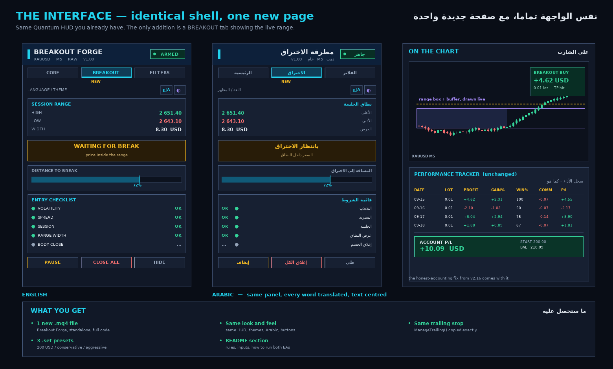

# Breakout Forge — proposal (awaiting approval, no code written yet)

## 1. What this is

A **second, standalone MT4 EA** for XAUUSD M5. It is not a modification of
Signal Forge PRO — it is a separate `.mq4` that reuses the same interface
shell and the same trailing stop, with a breakout engine in place of the
11-indicator voting engine.

Both can run on the same chart at the same time: different magic numbers,
separate panels, separate trackers.

## 2. The strategy

Gold's false-breakout rate is **60–70%**, and the most repeatable trap of the
day is the sweep of the Asian range just before London. The entire design is
therefore about *rejecting* breaks, not chasing them.

### The range
Either **session mode** (high/low of a configurable window, default the Asian
session 00:00–07:00 server time) or **Donchian mode** (highest high / lowest
low of the last N closed bars, default 20).

### The trigger
A trade requires **all eight**:

| # | Condition | Why |
|---|---|---|
| 1 | Candle **body** closes beyond range ± buffer | a wick through the level is a sweep, not a break |
| 2 | Buffer = `0.25 × ATR` (or fixed points) | scales with volatility instead of a fixed pip count |
| 3 | `ATR(14) > 0.8 × SMA50(ATR)` | volatility must actually be expanding |
| 4 | Spread ≤ `MaxSpread` | a wide spread destroys the R:R before entry |
| 5 | Inside the session window | London / NY overlap only |
| 6 | Range width within min/max | too tight = noise, too wide = stop too far |
| 7 | Not in rollover blackout (20:00–22:00) | spread blows out |
| 8 | Daily loss limit not reached | hard stop for the day |

### Optional retest mode
Instead of entering on the breakout close, wait for price to come back to the
broken level and hold. Fewer trades, better entry price, tighter stop. Off by
default; a single input turns it on.

### Exit
* **Stop** — opposite side of the range − `0.5 × ATR`, floored at the broker's
  `MODE_STOPLEVEL`.
* **Target** — `2 × ATR`, or the measured move (range height projected), input-selectable.
* **Trailing** — `ManageTrailing()` **copied byte for byte** from Signal Forge
  PRO: same `TrailingStartPoints` / `TrailingDistancePoints` / `TrailingStepPoints`,
  same stop-level clamp, same step logic.

### $200-account sizing
Default `0.01` lot, one position at a time, hard daily loss limit. At $0.07
round-turn commission per 0.01 lot, the minimum target is held at **≥ 3× total
cost** so a winning trade is never eaten by fees.

## 3. The interface

Identical to what you have now — same Quantum HUD, same solid raised cards,
same vivid themes, same Arabic engine, same live LANGUAGE and THEME buttons,
same on-chart result cards, same performance tracker including the v2.16
honest-accounting fix.

**One new page**: a `BREAKOUT` tab between CORE and FILTERS showing
range high / low / width, the live state (`WAITING` → `BROKEN` → `RETEST` →
`IN TRADE`), a distance-to-break meter, and the 8-point checklist lighting up
green as each condition passes.

**One new chart object**: the range box with its buffer line, drawn live.

## 4. Deliverables

1. `Breakout Forge XAUUSD M5 EA.mq4` — complete, full code, no fragments.
2. Three `.set` presets — 200 USD / conservative / aggressive.
3. A README section — rules, every input, and how to run both EAs together.
4. Verifiers extended to cover the new engine.

## 5. Open questions

1. **Range source** — Asian session box, or Donchian(20)? (Can ship both, one input.)
2. **Entry style** — breakout close (more trades) or retest (better R:R)? (Can ship both.)
3. **Session window** — London open only, or London + NY overlap?
4. **File name** — `Breakout Forge XAUUSD M5 EA.mq4`?

Defaults if you simply say "go": session range + Donchian both available with
session as default, breakout-close entry with retest as an option, London+NY
overlap, 0.01 lot, and the name above.
